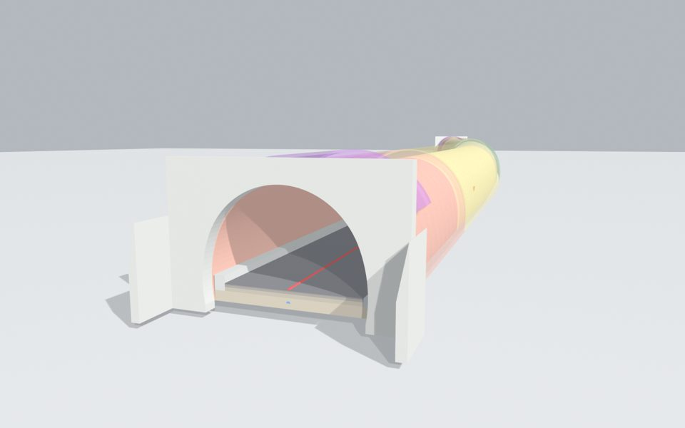
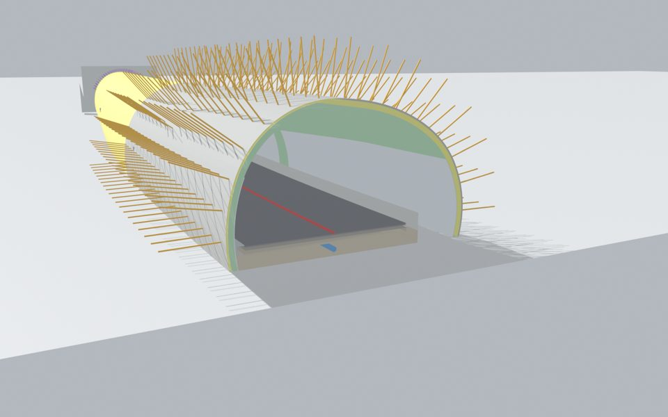

# 山岳トンネル 詳細度(LOD)ビューア / Mountain Tunnel LOD Viewer

国土交通省「BIM/CIM活用ガイドライン(案) 第1編 共通編」表1-2 (山岳トンネルの例) に定義された
**詳細度 100 / 200 / 300 / 400 / 500** を、汎用的な2車線道路トンネルの3Dモデルで
実際に切り替えて比較できる Web ビューアです。ブラウザだけで動きます (サーバ不要)。

発注者・受注者の事前協議で「詳細度○○とはどこまで作り込むのか」を実物で確認する用途を想定しています。

**▶ 公開ページ**: `https://<GitHubユーザー名>.github.io/tunnel-lod-viewer/` (Pages 有効化後)

| 詳細度300 (坑口) | 詳細度400 (断面) |
|---|---|
|  |  |

## できること

* 詳細度 100〜500 をボタンで切替
* 含まれる要素を分類ごとに一覧表示、個別に表示/非表示
* 任意測点での断面カット (No.0〜240)、ワイヤーフレーム、覆工の透過表示
* 各詳細度の定義文 (共通定義・山岳トンネルのモデル化) をパネルに表示

## モデルについて

**実在の案件の図面・モデルは一切使用していません。** 断面・線形・支保パターン配置はすべて一般的な値から新規に設定した架空のものです。

| 項目 | 設定値 |
|---|---|
| 延長 / 線形 | 240 m、直線 60 m + R=500 m 曲線 120 m + 直線 60 m、縦断勾配 +1.0 % |
| 内空断面 | 2車線 3心円 (R1=5.15 m, R2=8.0 m)、覆工 30 cm、インバート 50 cm (DⅢ区間) |
| 支保パターン | DⅢa (No.0-30) / DⅡ (30-90) / DⅠ (90-150) / DⅡ (150-210) / DⅢa (210-240) |
| その他 | 非常駐車帯 (No.100-140)、箱抜き 4箇所、フォアポーリング (坑口部)、覆工鉄筋 (坑口部 30 m)、面壁式坑門工 |

### 詳細度ごとに含めた要素

| 詳細度 | ガイドラインの定義 (山岳トンネル) | このモデルの内容 |
|---|---|---|
| 100 | 位置を示す矩形・線状のモデル | 中心線形、位置ボックス、坑口位置マーカー |
| 200 | 中心線形 + 標準横断面のスイープ。坑口は位置のみ | 標準横断面 (覆工+吹付を一体化) のスイープ、路面 |
| 300 | 主構造の外形が正確。拡幅部、支保パターン範囲・補助工法・箱抜きは記号、坑口部外形、内空設備 | 覆工 (区間別色分け)、吹付け、インバート、拡幅部、坑門工、舗装4層・監視員通路・側溝・排水管、各種範囲記号 |
| 400 | 300 + ロックボルト・配筋を含む全て | ロックボルト全数、鋼製支保工、覆工鉄筋、防水シート、内装板、フォアポーリング、箱抜き形状 |
| 500 | 完成形状を反映 | 400 + 余掘りを反映した掘削出来形、照明・ジェットファン等の完成設備 |

## ファイル構成

```
index.html           ビューア本体 (three.js を CDN から読込)
LOD100..LOD500/      各詳細度の GLB モデル (Y-up)
model_summary.json   部材一覧 (名称・分類・初出詳細度・三角形数)
images/              説明用レンダリング画像
scripts/             モデル生成スクリプト (Python) と Blender レンダリングスクリプト
```

IFC4 / DXF / OBJ 形式のモデルはサイズが大きいため、[Releases](../../releases) に zip で添付しています。

## ローカルで動かす

```bash
python -m http.server 8000
# → http://localhost:8000/
```

## モデルを再生成する

```bash
pip install numpy ezdxf ifcopenshell trimesh networkx
python scripts/tunnel_lod_gen.py <出力フォルダ>
```

`scripts/tunnel_lod_gen.py` 冒頭の `P` (断面・線形・設備寸法) と `PATTERNS` (支保パターン区間) を書き換えると、別断面・別延長のサンプルを同じ手順で出力できます。GLB / OBJ は Y-up、DXF / IFC は Z-up です。

## ライセンス・出典

* コードおよびモデル: [MIT License](LICENSE)
* 詳細度の定義文: 国土交通省「BIM/CIM活用ガイドライン(案) 第1編 共通編」(令和4年3月) 表1-2、および社会基盤情報標準化委員会「土木分野におけるモデル詳細度標準(案)【改訂版】」(平成30年3月) より引用
* 3D描画: [three.js](https://threejs.org/) (MIT)

---

## English summary

A browser-based viewer that lets you switch between Level of Detail 100 / 200 / 300 / 400 / 500 as defined in MLIT Japan's BIM/CIM Guideline (Table 1-2, mountain tunnel example), using a generic two-lane NATM road tunnel model (240 m, generated procedurally; no real project data). Static site: `index.html` + GLB files, three.js loaded from CDN. Regenerate models with `scripts/tunnel_lod_gen.py`. MIT licensed.
